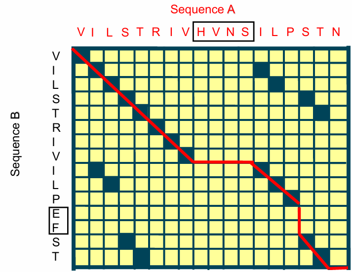

# Bio-informatics Databases
  
## **GeneBank for nucleic acid data**
  
## **Uniprot for protein sequences**
  
### Compositions and sources
  
#### Compositions
  
- UniProtKB/Swiss-Prot (manually annotated and reviewed)
- UniProtKB/TrEMBL (automatically annotated and not reviewed)
  
#### Sources
  
- Uniprot: all encapsulate
- UniRef: Non-redundant
- UniParc: Records previous status
  
### [Accession](https://www.uniprot.org/help/accession_numbers )
  
>Accessions are stable identifiers and should be used to cite UniProtKB entries. Upon integration into UniProtKB, each entry is assigned a unique accession number, which is called 'Primary (citable) accession number'.
>We remind users that they should always use the primary accession number of an entry in any citation and link since it is the only unique stable identifier for an entry.
  
## **PDB for protein structures**
  
## **Protein Sequence Alignment**
  
>- Sequences longer than 150 amino acids with over 25% sequence identity are probably related.
>- With between only 15 and 25% sequence identity, they may be related (TWILIGHT ZONE)
>- With less than 15% sequence identity, additional information, such as structural and functional, is required to determine if the proteins are related.
  
### **Global Alignment Algorithm Using Dynamic Programming: Needleman-Wunsch Algorithm**
  

  
Some fundamental concepts behind this algorithm is *match*, *mismatch*, and *gap*. In above figure, what we can see is some slashed lines and some horizontal/vertical lines, with the horizontal/vertical lines denoting *gaps*, the coloured slashes denoting *matched residues*.
  
According to this figure, the horizontal line indicates that to maximise the overall score, four gaps are introduced into Sequence B to align with residue `HVNS` in Sequence A. The verticle line indicates two gaps are introduced into Sequence A in contrast.

#### Python Implementation

Following is a Needleman-Wunsch algorithm implemented in Python:

    import numpy as np
    
    class NW():
        def __init__(
                self, seqa:str, seqb:str, 
                match, mismatch, gap
        ):
            self.seqa = seqa
            self.seqb = seqb
            self.match_score = match
            self.mismatch_score = mismatch
            self.gap_score = gap
            self.matrix = np.zeros((len(seqa)+1, len(seqb)+1))
            self.matrix.fill(np.inf)
            self.matrix[:, 0] = [self.gap_score * i for i in range(self.matrix.shape[0])]
            self.matrix[0, :] = [self.gap_score * j for j in range(self.matrix.shape[1])]

                    
        def _scoring(self):
            for row_idx, i in enumerate(self.matrix):
                for col_idx, j in enumerate(i):
                    
                    if j != np.inf:
                        pass
                    else:
                        '''
                        lt: right top (diagonal)
                        lt_: rt + match or mismatch
                        rb: right bottom
                        lt: left top
                        '''
                        lt = self.matrix[row_idx-1, col_idx-1]
                        lt_ = lt + self.match_score if self.seqa[row_idx-1] == self.seqb[col_idx-1] else lt + self.mismatch_score
                        
                        lb = self.matrix[row_idx, col_idx-1]
                        rt = self.matrix[row_idx-1, col_idx]

                        score = np.max([lt_, lb+self.gap_score, rt+self.gap_score])

                        self.matrix[row_idx, col_idx] = score

            return self.matrix
        
        def _traceback(self,):
            seqa_output, seqb_output = [], []
            row = self.matrix.shape[0] - 1
            col = self.matrix.shape[1] - 1

            while row > 0 or col > 0:

                # How N&W gets rid of local optimum

                #print(f'row: {row}, col: {col}')
                current_score = self.matrix[row, col]

                if row > 0 and col >0:
                    #match_val = self.match_score if self.seqa[row-1] == self.seqb[col-1] else self.mismatch_score
                    match_val = self.match_score if self.seqa[row-1] == self.seqb[col-1] else self.mismatch_score
                    #print(match_val)
                    if current_score == self.matrix[row-1, col - 1] + match_val:
                        seqa_output.append(self.seqa[row-1])
                        seqb_output.append(self.seqb[col-1])
                        
                        row -= 1
                        col -= 1
                        continue
                    
                if col>0 and current_score == self.matrix[row, col - 1] + self.gap_score:
                    seqa_output.append('-')
                    seqb_output.append(self.seqb[col-1])
                    col -= 1
                    continue

                if row > 0 and current_score == self.matrix[row - 1, col] + self.gap_score:
                    
                    seqa_output.append(self.seqa[row-1])
                    seqb_output.append('-')
                    row -= 1
                    
                    continue

                    
            seqa_output.reverse(), seqb_output.reverse()
            return seqa_output, seqb_output
        
        def align(self):
            score_matrix = self._scoring()
            #print(score_matrix)
            seqa_output, seqb_output = self._traceback()
            return seqa_output, seqb_output

    nw = NW(seqa, seqb, match=1, mismatch=-1, gap=-2)
    seqa_, seqb_ = nw.align()

As what the code shows, there are some major flaws in this algorithm:

#### Some Problems to be Solved
  
- The scoring procedure is not flexible enough. To resolve this problem, [substitution matrices](https://en.wikipedia.org/wiki/Substitution_matrix ) might be an option.
  
- High time complexity $O_{(mn)}$. So [heuristic search algorithms](#heuristic-search-algorithm ) are needed.
  
- Considering sequence similarity only. Proteins with closely related sequences are less universal in the evolution process.
  
### **Local Alignment Algorithm and its derivation**
  
[Smith-Waterman algorithm](https://zh.wikipedia.org/wiki/%E5%8F%B2%E5%AF%86%E6%96%AF-%E6%B2%83%E7%89%B9%E6%9B%BC%E7%AE%97%E6%B3%95 )
  
  
### **Basic Local Alignment Search Tool (BLAST) alignment**
  
#### **Methods: Heuristic Search Algorithm**
  
The minimal searching units are k-mer tuples, instead of a single residue.
  
To do this, the first step is to construct a k-mer table [^1].
  
#### **Methods: Local Alignment**
  
The local alignment strategy in BLAST can be described by a *Seeding-Scanning-Extension* workflow.
  
The seeding process is based on the aforementioned [heuristic search method](#methods-heuristic-search-algorithm ). The expected outcome of *seeding* is obtaining a bunch of "similar" k-mers.
  
*Scanning* tries to locate the k-mers obtained in *seeding* among sequences in databases.
  
Subsequently, sequence elements at two ends of seeds compare with the corresponding amino acids (or nucleic acids) in searched sequences, along with scoring element-wise. This process, *extension*, terminates as the score starts to decrease and attains a high-scoring segment pair, **HSP**.
  
For both protein sequence alignment and nucleotide sequence alignment. BLASTN is the platform to perform a nucleotide alignment, while BLASTP is the platform to perform a protein alignment.
  
### BLAST Setup
  
#### **Max target sequences**
  
#### **Max matches in a query range**
  
#### **Database**
  
- Non-redundant (nr) db is the default database used in BLAST search.
- Clustered db like **UniRef90** and **UniRef50** are more prefered, where UniRef90 clusters sequences have 90% sequence identity. UniRef50 clusters sequences have 50% sequence identity.
- RefSeq and Swiss-Prot are databases smaller in scale, but composed of manually annotated entries.
  
Since the significant difference between clustered db and other non-clustered dbs is **entries with a similarity larger than the specified value** will be merged into one entry, the searching time can be significantly reduced by adapting clustered dbs, while at a cost of slightly resolution reduction.
  
#### **Scoring matrix**
  
Changing the substitution matrix causes different searching results.
  
Read about substitution matrices on [Wikipedia](https://en.wikipedia.org/wiki/Substitution_matrix ) and [NCBI BLAST](https://www.ncbi.nlm.nih.gov/blast/html/sub_matrix.html ).
  
### Result Interpretation: GenBank and Graphview
  
View external information for each hit from the link to **GenBank** or **Graphview** (legend: [NCBI Graphview legend interpretation](https://www.ncbi.nlm.nih.gov/tools/sviewer/legends/#anchor_8 ))
  
### Result Interpretation: Layout
  
|Organism|Blast Name|Score|Number of Hits|
|---|---|---|---|
|Relevant close to far, the most distantly-related taxon is located at the last second row| |Descending|Descending|
  
### Result Interpretation: Parameters
  
#### **Query Coverage**: What proportion of the queried sequence is involved in the match

$$
Coverage = \frac{Alignment\quad length}{Query\quad sequence\quad length}\times 100\%
$$
  
#### **Percentile Identity**: What proportion of amino acids is identical in the compared region

$$
Identity = \frac {Alignment\quad length}{min(A, B)}\times 100 \%
$$
  
$A$ is the length of the reference sequence. $B$ is the length of the mobile sequence.
  
#### **Bit Score**
  
Bit scores are normalised raw scores making raw scores obtained through different algorithms comparable.
  
>The bit score tells you the alignment score that BLAST calculated between your query sequence and the hit. This is a measure of how good the hit is. Take care when interpreting this as the maximum score possible is a function of the length of the query sequence and the hit. Bit scores between BLAST searches with different query sequences are not comparable.
  
#### **E-value:** The significance of the match
  
>The e-value tells us how many hits with this score or better we would expect to find at random, given the size of the sequence database we searched.
  
##### Formula to calculate
  
$$
E = K \times m\times n\times e^{-lambda \times S}
$$  
  
Where *S* denotes the homolog scores between two sequences, *m* denotes the length of the target sequence, *n* denotes the size of the database, and *K* and *n* are parameters depending on the algorithm and database.
  
##### Values
  
- E-value < 0.01: commonly considered significant, but there are features of biological sequences which can confound this so care is advised
  
- E-value < 1e-5: usually homologues
  
- E-value > 0.01: doesn't necessarily mean a hit is false
  
- E-values are normalised based on each database. Only E-values from the same db are comparable.
  
- Bit scores between BLAST searches with different query sequences are not comparable.
  
#### **Length of hit**
  
> It is possible to get good (i.e. small) e-values even if only a small regions of your query sequence is matched by a hit. In such instances you might consider very short matches as False Positives, even when the e-values are below the values you're looking for.
  
### Other BLAST algorithms
  
|Search Programme|Query|Hit|
|---|---|---|
|BLASTX|Input nucleotide, translate/ map to protein|Protein db|
|TBLASTN|Input protein|Nucleotide db, map to protein|
|TBLASTX|Input nucleotide, map to protein|Nucleotide db, map to protein|
  
### Result inspection
  
Check the organism of the query and hit.
  
Hit with a high bit score but presents in an irrelevant organism might be an FP.
  
Also, be aware of **Low complexity regions**. Low complexity regions are regions composed of highly duplicated regions, which are commonly observed in hydrophobic regions of transmembrane proteins. A BLAST search may hit these sequences and yield high scores, but be devoid of biological meaning.
  
## **MSA**

## **Bioinformatics as evolutionary analysis**

### Concepts to be clear: Homolog, Paralog, and Ortholog

- Homolog: Two genes sharing the same ancestor are homologous.
- Paralog: homologs found within an organism.
- Ortholog: homologs found between organisms.

### Mutation under molecule-level aspect

The predominant mutations are detrimental, with organisms being purified in turn.
The remained mutations can either be neutral in phenotype (randomly accepted) or positive.

#### Mutation at genetic level

- Substitution (silent, missense, or nonsense)
- Insertion
- Deletion

#### Mutation at chromosomal level
- Deletion  
- Translocation and inversion
- Gene conversion
- Duplication 

There are various possible fates of the gene which undergoes a duplication:

- Exerting the same effect as the original gene.
- Being "muted": lose expression ability.
- Evolving to undertake new biology functions.

[^1]: the usually case is that k=3, which means the whole table contains $20^3$ trigram residue tuples.
  