# Design an Expression Construct

The very basic procedure is to find out the gene sequence expressing the protein we want to clone, and to insert the gene sequence into a specific vector.

## Protein Sequence to Gene Sequence

### Obtain the Protein Sequence in PDB

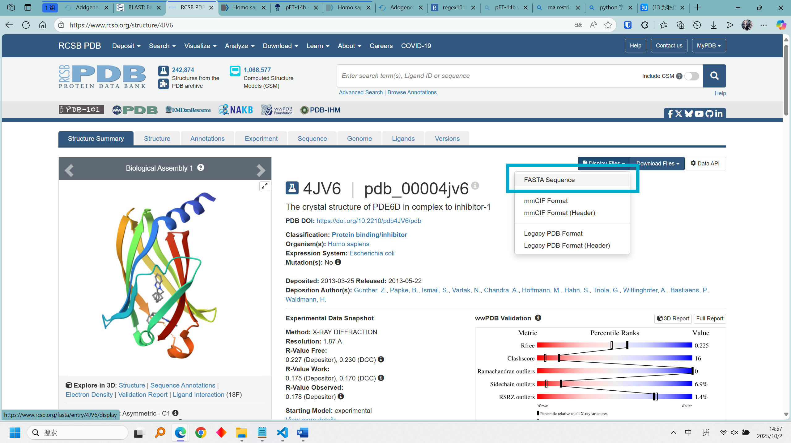

So we get the protein FASTA sequence.

More information about the protein sequence is available in the Sequence Tab or Uniprot.

### BLAST Protein to Gene

The BLAST tool used here is tblastn, which 'translates' a protein sequence into a nucleic acid sequence.

Remember to change `Database` to `RefSeq Select RNA sequences (refseq_select)`.

On the new page, information such as biological role, Function/mechanism, Tissue of origin, Disease relevance/known mutation can be found. This time, we just focus on its GeneBank **accession**.

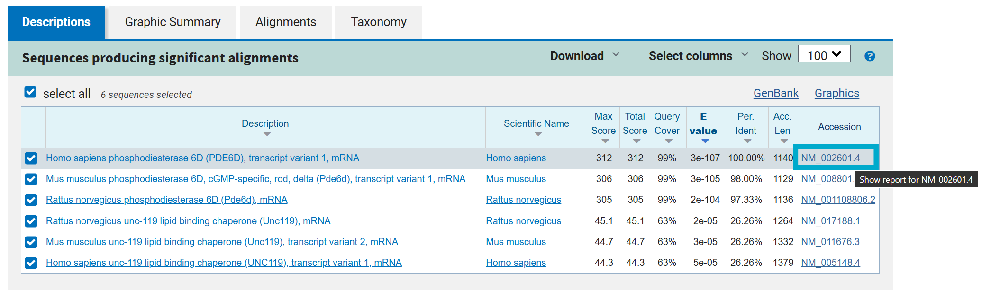

Note that, entries start with accession *NM_* indicate that they are mRNA. The whole sequence structures in these entries can be represented in the following figure:

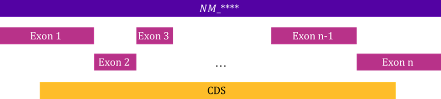

Those entries starting with *NG_* or *NC_*, which contain introns, refer to *genome reference sequences* and *chromosome sequences*.

Focus on the following fields in the new page:

**Gene**: Clicking 'gene' will show you a whole gene sequence at the bottom of the page.

**Exon**:  click 'exon'. A part of the gene sequence will be highlighted.

**CDS**: click 'CDS' (codons). Highlighted part reflects what is translated by a ribosome. The sequence starts with a start codon and terminates with a terminating codon. We can also find a translated protein sequence at the bottom-left area.

What we want in this job is the codon sequence, since some genomic fragments in the whole gene or exons do not express protein, clicking `Display: FASTA` enables us to copy the codon sequence.

Now, we have finished all preparation steps. We will move to [Benchling Lab](https://benchling.com/) and start inserting the obtained gene sequence into a vector.

## Obtain Vector Sequence

The vector is first obtained via [Addgene](www.addgene.org). Search for the vector we want and copy the sequence.

## Insert Sequence into Vector in Benchling Lab

Go back to [Benchling Lab](https://benchling.com/), and create a new DNA sequence.

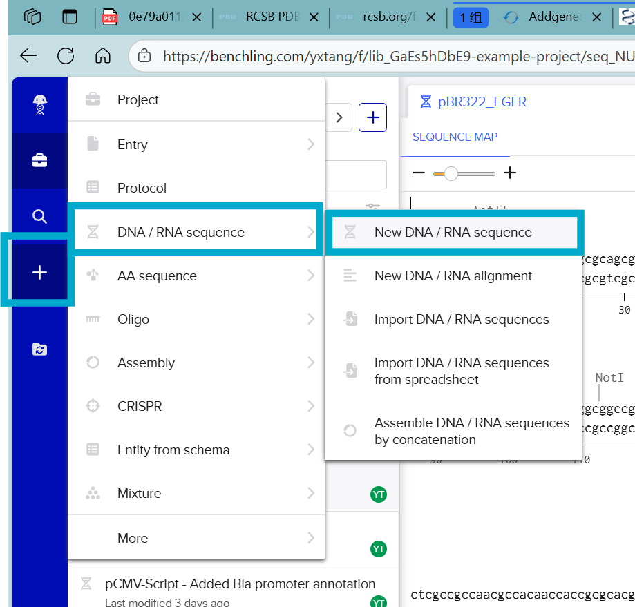

### Add Annotations

Some annotations can be added automatically, or add them manually according to instructions.

### Insertion

The recognition segment and the cutting site are shown when hovering mouse over a restriction enzyme name.

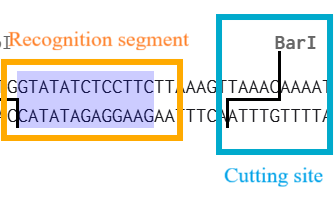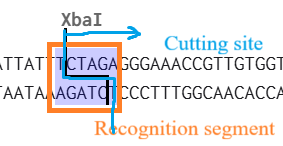

One critical point to be aware of is how to select the right place to insert the gene.

Taking the second restriction enzyme as an example, the purple highlighted area is the enzyme recognition segment, with a zig-zag solid line referring to the cutting site.

#### Insertion Location

The insertion of nucleic acid sequence must locate at the right side of `A-T` pair or the left side of `T-A` pair on margins of the recognition segment, although the cutting is irrelevant to `T-A` and `A-T`, because the insertion within recognition segment may 'damage' the recognition segment.

#### Avoid self-rejoin

Another point is that both terminals of the cutting site should not be compatible with each other, aiming to avoid the self-rejoin of plasmid terminals

#### Avoid frame-shift mutation

Moreover, the inserted nucleic acid sequence must line up with the ORF and have a sequence length of $3n$ so there is no 'frame-shift' mutation.

#### Optimize Inserted Codons

>One important consideration is that the insert should not be cut by the restriction enzymes that will be used in cloning.
>If we are getting the coding sequence synthesised, we can do two things at once: make sure that the codons that are being used give the protein the best chance at high expression, and avoid sites recognised by restriction enzymes we are planning on using.

Two objectives:

- Make sure there are no restriction enzyme recognition sites.
- Balance the base usage.

Note that, the optimised codons will not replace the original codons automatically. Copy optimised codons and substitute the original codons to apply the optimisation.

#### Insertion Direction

Another point to be aware of is the 'direction' of inserted gene segments. Since the DNA is a double-stranded structure, if the protein we desire is expressed by the gene segment on the reverse chain, we should not simply insert the gene in a forward direction, but its reversed complementary nucleic acid sequence.

One example is the question in the homework:

> If you have time, try performing the same process with a prokaryotic expression vector: [pET-14b](https://www.addgene.org/vector-database/2542/) for expression in E. coli with an N-terminal hexahistidine tag. To to this you need to make sure that the codons of the insert line up with the codons of the histidine tag so there is no ‘frame-shift’ mutation.

The gene sequence expressing 6 His tag is located on the reverse chain. Meanwhile, we have to keep the tag on the N-terminal of the expressed protein.

I first tried to address the problem by reversing the string and mapping its complementary base in a dict in Python:

        forward_seq = 'ATGTCAGCCAAGGACGAGCGGGCCAGGGAGATCCTGAGGGGCTT'
        pattern = {
        'A':'T', 'T':'A', 
        'C':'G', 'G':'C'
        }
        implementary_seq = ''

        for i in forward_seq[::-1]:
            i_ = pattern[i]
            implementary_seq += i_

        print(implementary_seq)

But this is obviously not very elegant.

An alternative solution I came up with is to create a new sequence in Benchling Lab, after which, copy its DNA reverse complement.

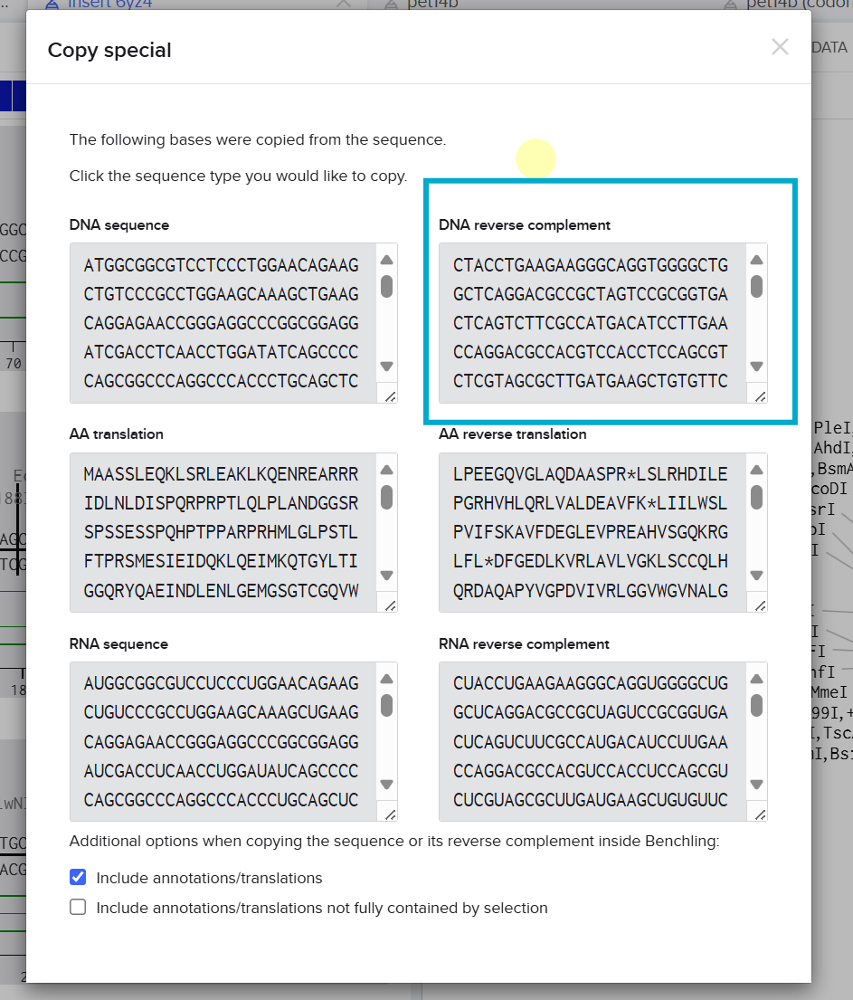

### Add Kozak Consensus Sequence

>Efficient initiation of translation in eukaryotes requires the presence of the Kozak consensus sequence, most commonly GCCGCCACCAUGG where ‘AUG’ corresponds with the start methionine ATG codon. This particular plasmid lacks this sequence, so we can add it by placing the cursor before the start codon and typing GCCGCCACC without anything else selected.

### Verify the Construct in [InterPro](https://www.ebi.ac.uk/interpro/)

In this section, I tried to identify whether the InterPro search is sensitive to the inputted sequence. Thus I uploaded:

- [The forward protein sequence expressed by the inserted gene segment](#forward-vs-reverse)
- [The reverse protein sequence expressed by the inserted gene segment](#forward-vs-reverse)
- [The codon-optimized reverse protein sequence expressed by the inserted gene segment](#codon-optimized-vs-un-optimized)
- [The reverse protein sequence with a 6-His Tag](#the-reverse-protein-sequence-with-a-6-his-tag)

Results are shown in the following screenshots:

#### Forward vs reverse

Protein chain expressed by the forward nucleic acid segment matches 0 hit, while the reversed expressed protein matches with 82 hits.
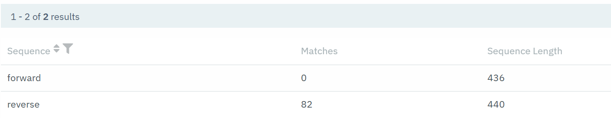

#### Codon optimized vs un-optimized

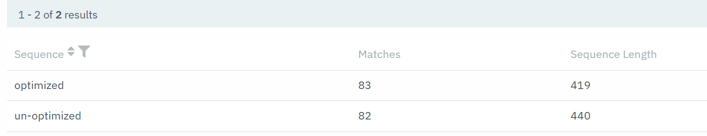
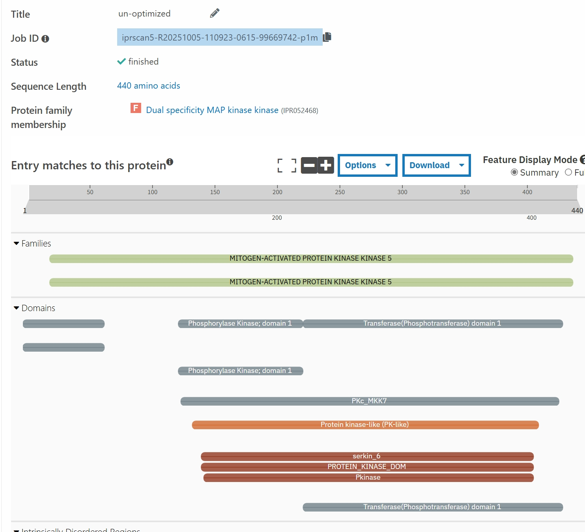
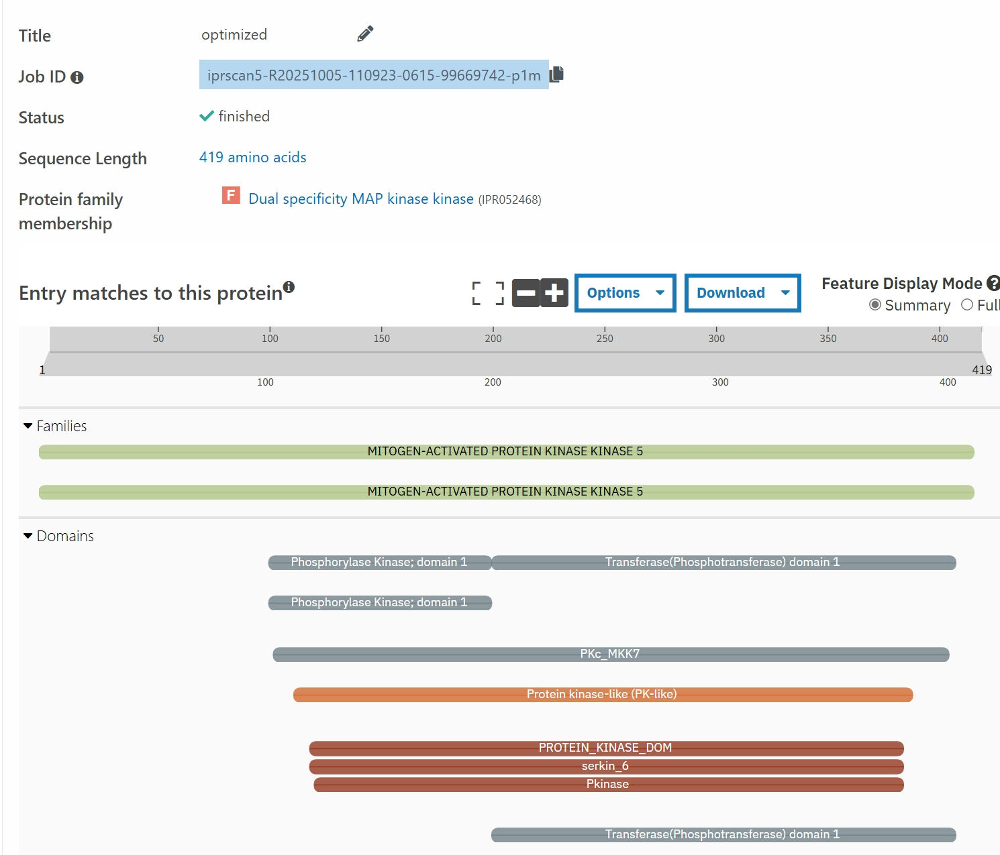

#### The reverse protein sequence with a 6-His Tag

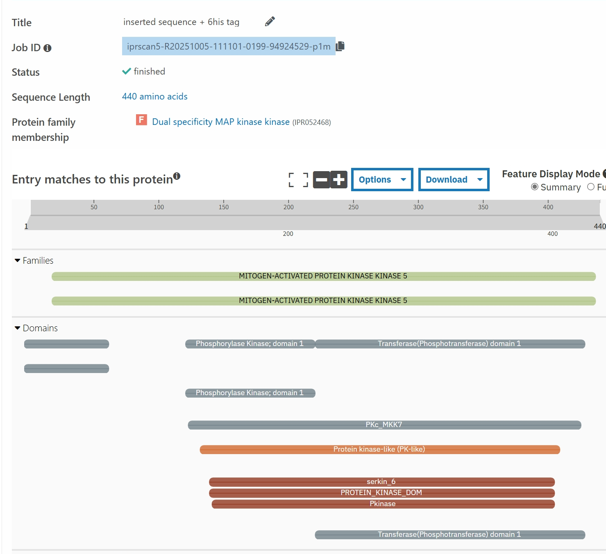
Zooming in, we have a 6-His tag on the N-terminal indeed.
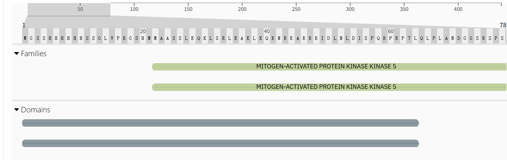
