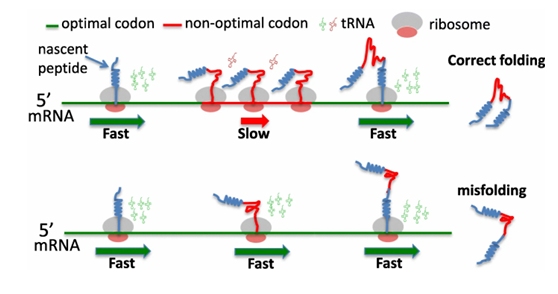
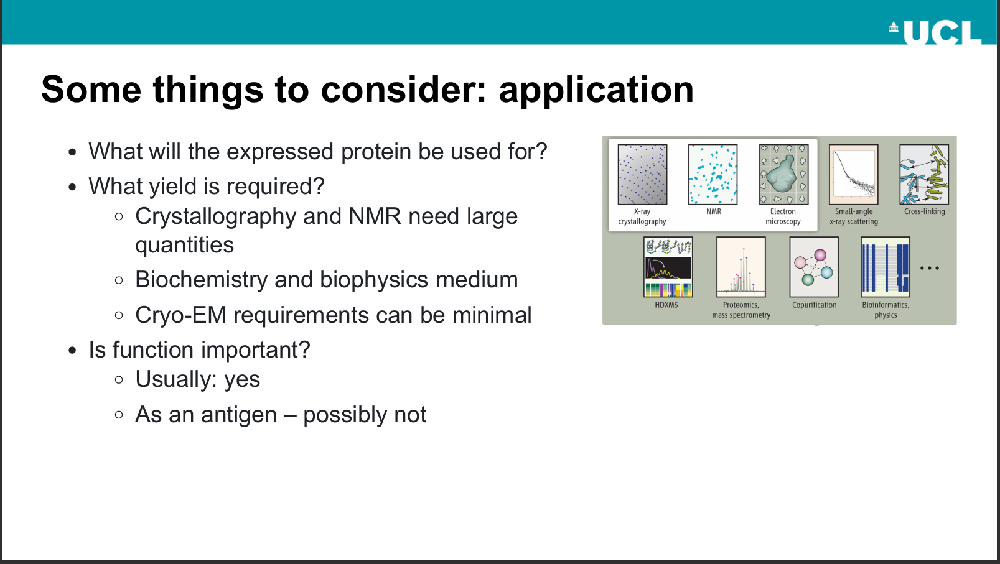
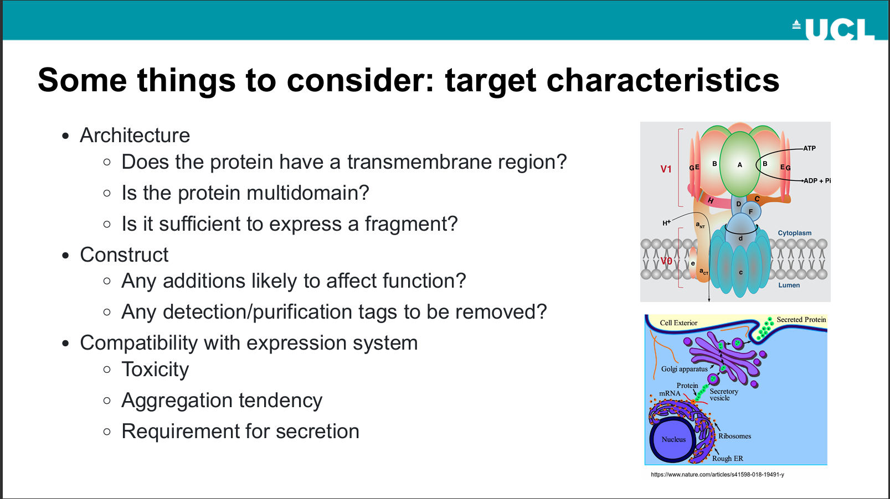
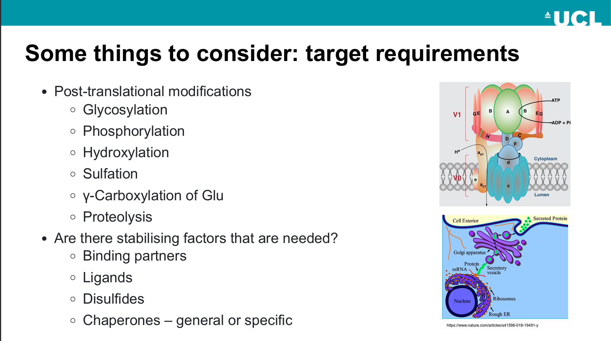
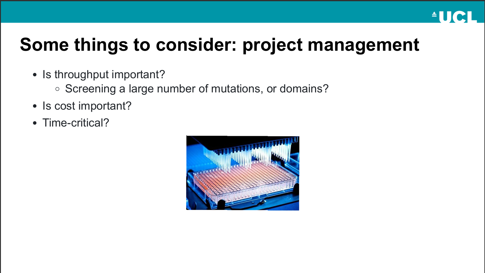
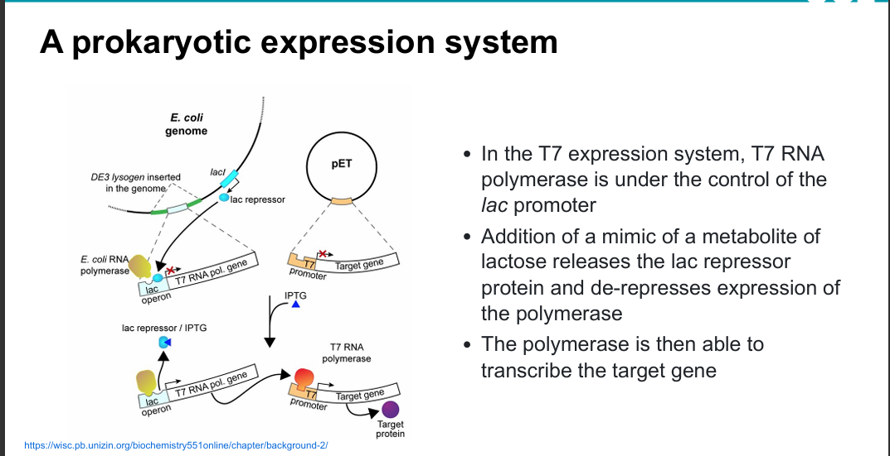

# Protein Cloning and Expression

## Why We Need Cloning?

- Exploit the expression capabilities for large-scale production.
- Work with the intended protein directly, instead of its orthologs.
- Highly customisable property makes it possible to add tags and purify the protein easily.
 
- Cost-effective.
- No risk of contamination by pathogens present in source material.

Research on the application of protein itself:

- Proteins as therapeutics in their own right.
- Diagnostic molecules.

Proteins as targets:

- Investigation in the involvement in a disease of interest

## Process

Main procedures include:

- [Isolate gene](#isolate-the-gene-of-interest)
- [Clone the gene into a vector](#clone-the-gene-into-a-vector)
- [Transfer](#transfer-into-a-host)
- Extract and purify the protein

### Isolate the Gene of Interest

#### Methods to Isolate genes

There are two methods to isolate gene from organisms: using cDNA libraries and using genomic DNA libraries.

cDNA library refers to the gene source derived from the reverse transcription of mRNA. A very straightforward feature is obtained genes do not have introns and reflect what is transcribed.

Genomic DNA library is another situation: introns are included because genes obtained through this method are derived from chromosomes. Meanwhile, regulatory genomic regions of DNA, along with other non-coding areas are also reserved.

#### Codon Optimisation

One thing to note is that **tRNA abundance discrepancies**[^1] are often observed between the gene source organisms and the expression hosts. This difference further alters the translation rate directly and may lead to protein misfolding or protein aggregation [^2]. Thus, **codon optimisation** is essential.

Other factors, such as the possible containing restriction enzyme cutting site in inserted gene, are also reasons why codon optimisation is needed.

### Clone the gene into a vector

Vector is a circular autonomously replicating DNA element. The most often used vector is the E. coli plasmid.

#### Components in vectors

There are two kinds of vectors: Expression vector and Cloning vector. The two types of vectors often do not co-exist in the same colony, unless extra complex [procedures](#choose-different-antibiotics) are executed. Differences between expression vectors and cloning vectors are shown below.

|Features|Cloning Vector|Expression Vector|
|---|---|---|
|Function|Used to clone, and reserve recombinant DNA|Expressing proteins|
|Promoters|Weak or None|Strong and controllable[^5]. Commonly used promoters include T7 or lac promoter[^6]|
|Tags|N/A|Owing tags such as soluble tag[^3] and TEV tag[^4]|

Standard components in vectors include:

- For reproduction: Origin of replication
- For transcription: transcription promoter/ terminator site and ribosome binding site (**Only exists in prokaryotic cells**)
- For translation: start/ stop codon
- [Antibiotic resistance gene](#antibiotic-marker)
- [Cloning site](#multiple-cloning-site-mcs)
- Tags, expression promoters, etc. (**Only exist in expression vectors**)

##### Antibiotic marker

Add an antibiotic marker to force the cell to maintain the inserted DNA element.

###### Choose different antibiotics

Some antibiotics are stricter in terms of the selective pressure they put cells under. Use these antibiotics in cases where the host expresses unfavourable genes. Commonly used antibiotics are ampicillin, kanamycin, and chloramphenicol.

Maintain more than one plasmid at a time.

##### Multiple cloning site (MCS)

MCS is a region in a cloning vector which does not exist in the wild-type E. coli. Rather, it is engineered by human and **contains numerous specific DNA sequences recognised by restriction enzymes**. Meanwhile, the original restriction enzyme system in E. coli is destroyed so that it will not degrade the inserted region.

There is a strategy to identify whether a gene sequence has been correctly inserted into the MCS called 'blue white selection'.

 MCS before recombinant -express-> One kind of protein -add specific substrate-> Become blue

 MCS with inserted sequence -> Fail to express that kind of protein -> No colour change when substrate added.

###### Restriction enzymes

Restriction enzymes are an array of enzymes that recognise specific DNA sequences and hydrolyse the phosphodiester bonds. Various types of cutting ends, such as blunt ends, 3'/5' overhangs, and single-strand overhangs, can be attained after the process of restriction enzymes.

#### Other cloning strategies

Ligation-independent cloning
Non-enzymatic approaches

#### Problems may occur

- Protein misfolding/aggregation
- Inclusion body formation
- Loss of production because of toxicity
- Fail to form disulfide bonds
- Absence of post-translation modification
- Presence of rare codons
- Product being degraded by proteases

#### Solution: Expression environment modification

Modify E. coli genes to:

- Create an oxidising environment
- Express cold resist chaperon and prepare for low temperature expression
- Produce tRNA of rare codons
- have mutations in transporters to allow titratable induction of expression

Decorating expressed proteins with signal peptides, which direct peptides to the ER or the plasma environment.

#### Solution: Modify the protein

- Add soluble tags to prevent aggregation
- Introduce a protease cleavage site that can be engineered to remove the tag before/after purification

#### Solution: Alter experiment conditions

- **Temperature**: Decreasing the expression temperature (low temperature expression) to slow down the expression speed
- **Timing**: Induce expression later than usual (avoid expressing in the log phase)

#### Solution: Express in a different host

##### Construct in prokaryotic cells, and express in eukaryotic cells

Construct and reproduction:

- In E. coli
- Vector contains origin of replication and selectable markers (antibiotic resistant gene)
- Muted expression promoters

Expression:

- In eukaryotic cells (mammalian cells, yeast cells, and insect cells)
- Send the plasmids into expression cells through transfection
- Activate eukaryotic promoters. Initiate transcription and translation
- Constitutive or inducive

Express in mammalian cells:

|Advantages|Disadvantages|
|---|---|
|Correct glycosylation|Time consuming|
|Chaperones assist in proper folding| Cell culture can only be performed for a finite amount of time|
|Cells secret proteins into the medium|Costly|

#### Miscellaneous

Express genes at the hosts' log phase, unless the expressed protein is toxic.

There are also some kinds of proteins hard to recombinant in E. coli, such as *transmembrane proteins*.

### Transfer into a host

Transformation is the process by which foreign DNAs are introduced into bacterial cells. This process can be achieved through **chemical** (osmotic pressure) or **electroporation**.

#### Transient transfection or stable transfection

Transient transfection: do not use an introducer to integrate DNA elements into the host DNA. As cells reproduce, introduced genes will be degraded and 'vanish'.

Stable transfection: Persistence of the transfer of genes through integration into the host's chromosome.

#### Choose an expression system based on requirements

||E. coli|Yeast|Mammalian|In vitro|
|---|---|---|---|---|
|Cost of growth medium|Low|Low|High|High|
|Product yield/volume|High|High|Low|High|
|Folded, functional mammalian protein|Sometimes|Often|Yes|Often|
|Glycosylation|No|Yes, but different|Full|Yes if mammalian|
|Time from cloning to expression|Fast|Medium|Slow|Fast|
|Ease of growth/ avoid contamination|Easy|Easy|Difficult|n/a|
|Location of recombinant product|Intracellular cytosol/periplasm|Intracellular or extracellular|Extracellular|Solution|

In summary, from E. coli to yeast to mammalian cells, the cost and time consumed on culture increase, while biological functions are better preserved.

### Problems to be concerned

[^1]: Some tRNAs are used preferentially in highly expressed genes.
[^2]: Nascent peptide chains find their conformation while they are being produced.
[^3]: Solubility tag: highly stable and quickly folding tags can stimulate the expressed proteins to fold while inhibiting aggregation.
[^4]: TEV tag: particular to protease, allowing the removal of tags before or after purification.
[^5]: lacl: lac repressor protein, to strongly repress baseline expression. It is helpful to handle toxic expressions so that leaky expression will not kill hosts.
[^6]: Shown is the prokaryotic expression system regulated by the lac operator. Some promoters might be too expressive, causing nascent nucleic acids sequences do not have enough time to fold then aggregate.
