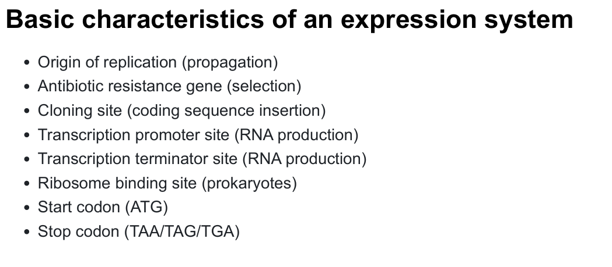
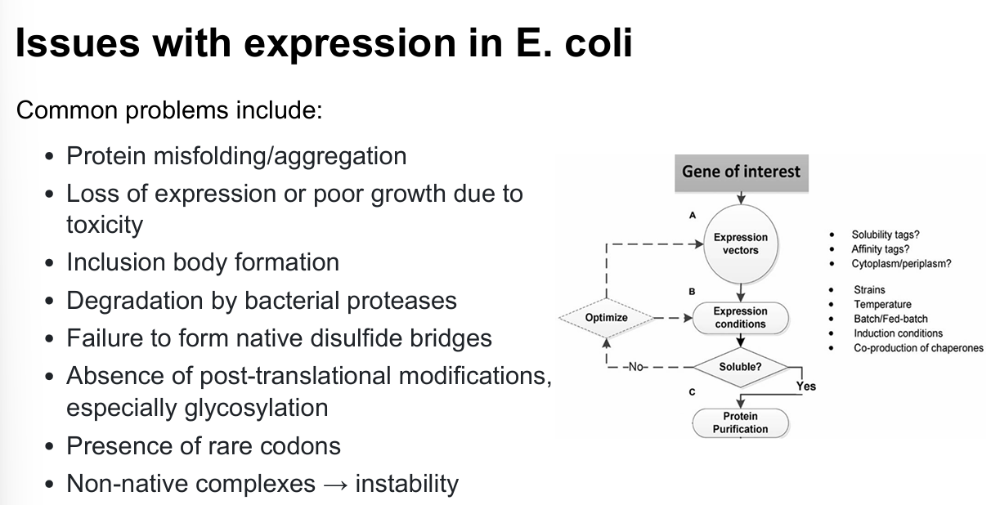

# Protein Cloning and Expression

## Why We Need Cloning?

- Exploit the expression capabilities for large scale production.
- Work with the intended protein directly, instead of its orthologs.
- Highly customizable property make it possible to add tags, purify the protein easily。

## Process

Main procedures include:

- [Isolate gene](#isolate-the-gene-of-interest)
- [Clone the gene into a vector](#clone-the-gene-into-a-vector)
- [Transfer](#transfer-into-a-host)
- Protein expression

### Isolate the gene of interest

There are two methods to isolate gene from organisms: using cDNA libraries and using genomic DNA libraries.

cDNA library refers to the gene sourced from reverse transcription of mRNA. A very straightforward feature is  obtained genes do not have introns and reflect what is transcribed.

Genomic DNA library is another situation: introns are included because genes obtained through this method come from chromosome. Meanwhile, regulatory genomic regions of DNA, along with other non-coding regions are also reserved.

One thing to note is that **tRNA abundance discrepancies**[^1] are often observed between the gene source organisms and the expression hosts. This difference further changes the translation rate directly, and may lead to protein misfolding or protein aggreation[^2]. Thus, **codon optimisation** is very necessary.

### Clone the gene into a vector

Vector is a circular autonomously replicating DNA element. The most often used vector is the E.coli plasmid.

#### Antibiotic marker

Add an antibiotic marker to force the cell to maintain the inserted DNA element.

#### Multiple cloning site(MCS)

A region in cloning vector does not exist in wild type E.coli. Rather, it is engineered by human and **contains numerouse specific DNA sequences recognised by restriction enzymes**. Meanwhile, the original restriction enzyme system in E.coli is destructed. So that it will not degrade the inserted region.

There is a strategy to identify whether a gene sequence has been correctly inserted into MCS called 'blue white selection'.

    MCS before recombinant -express-> One kind of protein -add specific substrate-> Become blue

    MCS with inserted sequence -> Fail to express that kind of protein -> No colour change when substrate added.

#### Additional elements in prokaryotic expression system

Typically have:

- Inducible promoter such as T7 promoter or lac promoter.
- lacl: lac repressor protein, to stronly repress baseline expression. It is useful to handle toxic expressions so that leaky expression will not kill hosts.
- Solubility tag: highly stable and quickly folding tags can stimulate the expressed proteins fold while inhibiting aggregation.
- TEV tag: very specific to protease, allowing remove tags before or after purification.

Some promoters might be too expressive, causing nascent nucleic acids sequences do not have enough time to fold then aggregate.

#### Choose different antibiotics

Some antibiotics are more strict in terms of selective pressure they put cells under. Use these antibiotics in case of expressing host unfavorable genes.

Maintain more than one plasmid at one time.

#### Problems may occur

#### Miscellaneous

Express gene at hosts' log phase, unless the expressed protein is toxic.

There are also some kinds of proteins hard to recombinant in E.coli such as *transmemberane proteins*.

### Transfer into a host

#### Transient transfection or stable transfection

Transient transfection: do not use an introducer to integrate DNA elements into the host DNA.

Stable transfection: On the contrary.

#### Transfer into a mammalian vector

|Advantages|Disadvantages|
|---|---|
|Correct glycosylation|Time consuming|
|Chaperones assist in proper folding| Cell culture can only be performed for a finite amount of time|
|Cells secret proteins into medium|Costly|

[^1]: Some tRNAs are used preferentially in highly expressed genes.
[^2]: Nascent peptide chains find their conformation while they are being produced.
