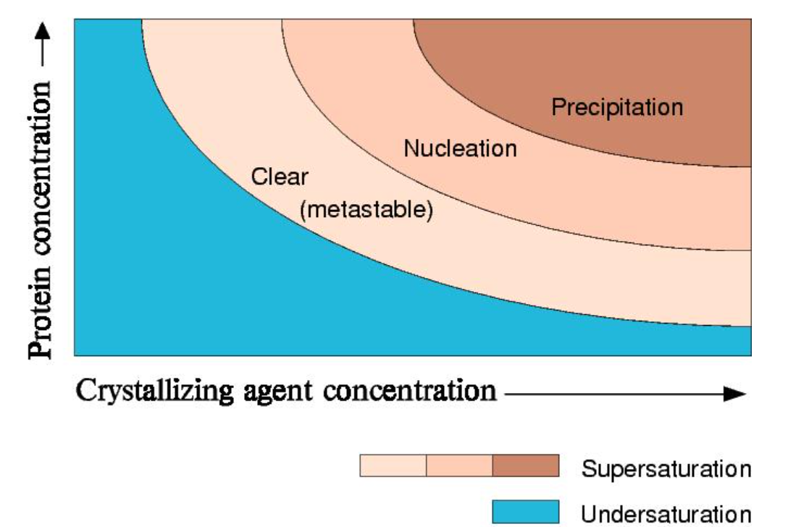

# Protein Representation

## X-Ray

### Protein crystal preparation

#### Crystallisation condition screening

Some crucial conditions to the protein crystallisation include : **pH** (controlled by Tris buffer), **solubility** (controlled by ammonium phosphate), **protein solution concentration**, **MPD (m-phenylene diamine) concentration**

#### Phase transition

To obtain a few, large protein single crystals, 

### 