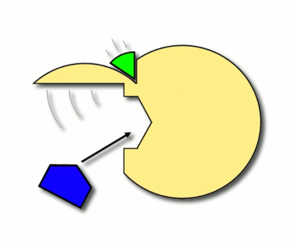
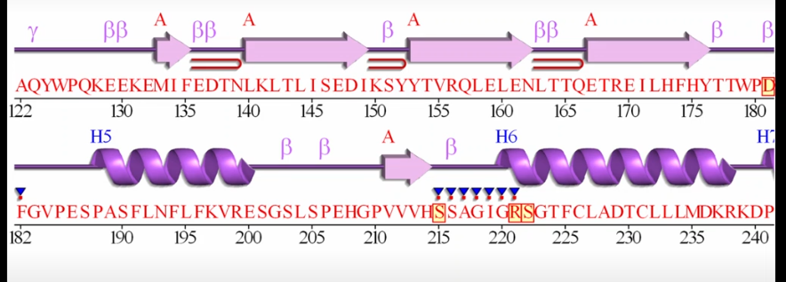
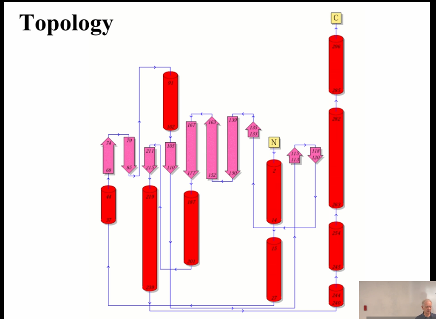
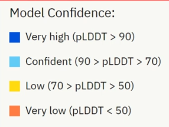

# Use of Bioinformatics databases

## Focus on the binding sites of proteins

Witness the common parts at which quite different drugs bind.

## Allosteric Control

    molecule A + Protein -> Protein conformation changed -> molecule B bind

## Structue explains evolution

**Structure tends not to change much over evolutionary time, whereas the sequence can change a lot.** Things which have diverged quite a long way may have very different sequences, which are almost impossible to detect by sequence search methods. But the structures will have remained the same because it is a structure that is key for performing the function.

During the evolutionary time, key domains occurs over and over again. Evolution keeps the things work maybe adds things on to modify that function.

## Problems caused by Point Mutations

- Truncation: Mutations cause stop codon in the middle of nucleic acid sequences.

- Misfolding: Mutations disrupt protein folding so it does not achiece its proper 3D structure.

- Mutations at the catalystic residue/ metal binding site/ substrate binding site.

- Mutations interupt protein-protein interaction/ protein-DNA interaction.

Predict exact changes from mutation is difficult, but got a known disease and a known variant can suggest the mechanism.

## Protein Data Bank

- view secondary structure and topology on [PDBsum](https://www.ebi.ac.uk/thornton-srv/databases/pdbsum/index.html)

- [ArchSchema](https://www.ebi.ac.uk/thornton-srv/databases/archschema/) shows structural domains and related domains.

### Problems

- Imcompletness: loss of certain substrands. 3D structure may only cover some part of the whole protein: getting the crystal for the whole protein is **difficult**, and it is easier to get crystal structure of a single domain.

- Biological Unit: Proteins do not work alone.

- Resolution: 3A resolution are not particularly reliable especially at the detail level.

## AlphaFold Predicts Protein 3D Structure

Homology modelling

### Confidence Metric

Only Focus on the 'Very high' and 'Confident' predicted regions.

Low confidence area eigher means data missing or structures are very mobile.

Split large protein models (hard to predict) into small sections and then overlap.

#### [Some Confidence Metrics](https://zhuanlan.zhihu.com/p/602879132)

##### RSMD

$$
d = \sqrt{\frac1N{\sum_{i=1}^{N}d_i^2}}
$$

where $d_i$ denotes the euclidean distance of a pair of aligned residues.

Caution that structures are aligned[^1] first, and all atoms except hydrogens are optional samples.

##### TM-Score

$$
S_{TM} = \frac1{L_N}{\sum_{i=1}^{N_T}}\frac1{1+(\frac{d_i}{d_0(L_N)})^2}
$$

$N_T$ is the number of matched residue pairs. $d_i$ is the euclidean distance of a pair of aligned residues. $L_N$ is the number of residues in reference sequences.

$d_0(L_N)$ is calculated through:

$$
d_0(L_N)=1.24\sqrt[3]{L_N-15}-1.8
$$

##### LDDT[^2]

LDDT is the sum of dRMSD and GDT. dRMSD do not align reference sequence and mobile sequence before calculation, but calculate $v_t$ and $v_p$.

$v_t$ and $v_p$ are two vectors representing distance information in reference protein and mobile protein. Suppose the reference protein has a sequence length $n$, $v_t\in\mathbb{R}^\frac{n\times (n-1)}2$, in which each component represents a distance between two identical atoms in the reference sequence. This applies to $v_p$ as well.

$$
LDDT_r = \frac{100}{4L}\sum_{t\in\left\{0.5, 1, 2, 4\right\}}\sum_{i=1}^L\frac{\sum_{j, |i-j|>r, D_{ij}<15}(|D_{ij}-d_{ij}|<t)}{\sum_{j, |i-j|>r, D_{ij}<15}1}
$$

$D_{ij}$ is the distance between atom $i$ and atom $j$ in the reference sequence, and $d_{ij}$ is those in the mobile sequence. $L$ is the sequence length. $t$ is the pre-set threshold. Summation is conducted on atom pairs meet $D_{ij}<15$ and $|i-j|\geq r$

[^1]: [Align algorithm](https://ieeexplore.ieee.org/document/88573)
[^2]: [LDDT paper](https://pmc.ncbi.nlm.nih.gov/articles/PMC3799472/)
