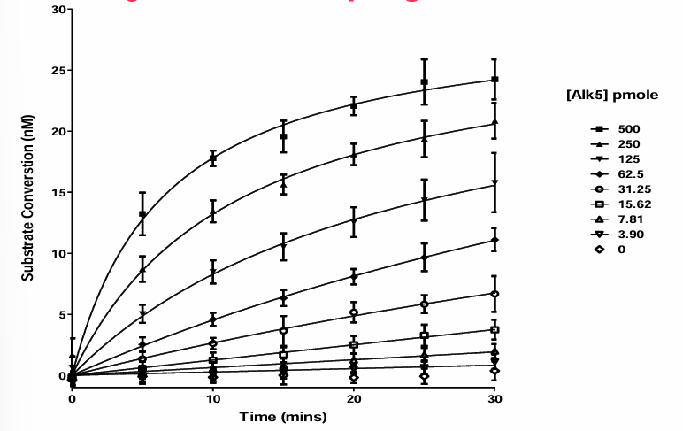

# Biological Data for Drug Discovery

Choosing the right assay for the target.

- Target activity
- Target engagement (biophysics)
- Biochemical
- Phenotypic readout

Each assay takes on a different liability in the whole process.

## **Some metrics used in assay**

### **Affinity**

#### **Quantitate Competitive inhibitors using $K_i$**

There is a problem to be considered when measuring inhibition constant $K_i$ in real experiments. So, in practical experiments, we cannot measure the inhibition constant without intruducing substrate[^1]. However, in this case, the experiment readouts do not actually represent the inhibition ability of inhibitors, but the relative affinity of inhibitors against substrates at the binding sites.

To measure the actual values, calibration is required. This is the starting point of the Cheng-Prusoff equation:

$$
K_i = \frac {IC_{50}} {1+ \frac {[S]} {K_m}}
$$

and

$$
{IC_{50}} = K_i \times {(1+ \frac {[S]} {K_m})}
$$

where $IC_{50}$ is the half inhibition concentration of inhibitors (note that $IC_{50}$ is measured in the presence of enzyme, substrate, and competitive inhibitors), $K_m$ is the Michaelis-Menten constant representing the substrate concentration when enzyme activity reaching half of maximum, and $[S]$ is the concentration of substrate.

The ratio $\frac {[S]} {K_m}$ represents the extent to which the substrate under experimental concentration binds to the enzyme. If the experiment $[S] \gg K_m$, the calibration factor will be significant, to eliminate the effect of introducing substrate. In contrast, if $[S] \approx 0$, the $K_i$ approximates $IC_{50}$.

### **$K_D$, $k_{on}$, and $k_{off}$**

$$
K_D = \frac {k_{off}} {k_{on}}
$$

where $k_{on}$ and $k_{off}$ is the association rate constant and dissociation rate constant, respectively.

Compounds with slow off rates can have selectivity and pharmacokinetics advantages

### **Z' and Z for evaluating measurement reliability**

$Z'$ is an evaluation of the separation degree between positive and negative signals.

$$
Z' = 1- \frac {3\times (SD_{positive} + SD_{negative})} {Mean_{positive} - Mean_{negative}}
$$
We often assume that $SD_{positive} = SD_{negative} = SD$ based on the experimental noises complying with I.I.D. A common threshold $Z' = 0.5$ implies:

$$
\frac {3\times (SD_{positive} + SD_{negative})} {Mean_{positive} - Mean_{negative}} = 0.5\\[16pt]
\frac {6\times SD} {Mean_{positive} - Mean_{negative}} = 0.5\\[16pt]
{Mean_{positive} - Mean_{negative}} = 12 \times {SD}
$$

Z score is the number of standard deviations away from the mean for a sample.

$$
Z = \frac {Sample - Mean_{negative}} {SD_{negative}}
$$

The statistic meaning behind is normalise sample signals with $\mu_{(negative)}$ and $\delta_{(negative)}$. For any sample signal whose $Z-score$  is larger than 3, it exhibits an obvious effect over negative samples.

## **Biophysical Assay**

Biophysical assays are used to measure physical signal changes caused by the **direct binding of compounds to targets**.

Some characteristic parameters, including $k_{on}$, $k_{off}$, and $K_D$ they derived, not accurately represented by $EC_{50}$ are accessible through biophysical assays.

The application of biophysical assays is limited by their lower throughput and larger sample consumption.

Commonly used assays include:

- Surface Plasmon Resonance (**SPR**): For the measurement of binding affinity ($k_{on}$, $k_{off}$, and $K_d$), specificity, and kinetics.

- Differential Scanning Fluorimetry (**DSF**): For the determination of **dissociation constant** [^2], monitor **thermal transitions of proteins** (such as unfolding), etc.

- Isothermal Titration Calorimetry (**ITC**): Very sensitive. Label free. But low throughput.

- H-NMR, Microscale Thermophoresis, etc.

## **Biochemical Assay**

Biochemical assays, featured for their high throughput, are approaches that measure impact on **protein activities**, and compound **potencies**.

There are some points mentioned in this section:

### Methods used to assay the activity of kinases: ADP-Glo kit

### Enzyme Reaction Progression Curve

This method evaluates reaction velocity by plotting substrate conversion (in concentration units) against time.

Prerequisites of a valid reaction progression curve includes:

- Establish the measurement at a linear range where it is commonly represented by a 10-20% substrate conversion rate.

Outcomes of the progression curve, reaction rate, are used to calculate enzyme constants through the MM equation, with the reaction rate (in units held in the form of concentration/ time) plotted against substrate concentration (in concentration units).

- MM assay is expected to be carried out when satisfying $[S]<K_m$.

### Scintillation Proximity Assay (SPA)

### Forster Resonance Energy Transfer

## **Cell-Based Screening Assay**

This is a high-throughput method of measuring cell activity.

Typical Methods include:

### Reporter Gene Assay: a high-throughput method of measuring cell activity

### Phenotypic Assay

The experiment objects can be various:

- Immortalised cells
- Primary cells
- Human cells

## Summary on different assay methods

||Biophysical|Biochemical|Cell Based|
|---|---|---|---|
|Parameters obtained from assays|$k_{on}, k_{off}, K_{D}$|Potencies ($EC_{50}$,$IC_{50}$, $K_i$[^3]); Protein activities|Cellular level metrics (cell activities). To model diseases accurately.|
|Throughput|Lower than biochemical assays| High|Often high throughput|
|Typical methods|Surface Plasmon Resonance(SPR), Differential Scanning Fluorimetry(DSF), Isothermal Titration Calorimetry(ITC)|Promega ADP-Glo kit, Scintillation Proximity Assay(SPA), Forster Resonance Energy Transfer(FRET)|...|

[^1]: Enzymes will not show catalyst activity in the absence of substrate.

[^2]: Suppose that there is a ligand, ligandA, that has high affinity to a specific protein, and a ligand, ligandB, with low affinity to the same protein. The binding between ligandA and protein decreases the overall system energy, which in turn requires a higher denaturing temperature and can be reflected by a change in fluorescent intensity. The binding between ligandB and protein has an opposite result.

[^3]: As what is mentioned [above](#quantitate-competitive-inhibitors-using-k_i), $K_i$ is the callibrated $IC_{50}$
