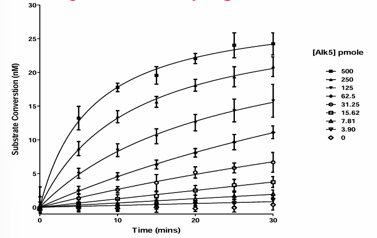

# Biological Data for Drug Discovery

Choosing the right assay for the target.

- Target activity
- Target engagement (biophysics)
- Biochemical
- Phenotypic readout

Each assay takes on different liability in the whole process.

## **Some metrics used in assay**

### **Affinity**

#### **Quantitate Competitive inhibitors using $K_i$**

There is a problem to be considered when measuring inhibition constant $K_i$ in real experiments. So, in practical experiments, we cannot measuring the inhibition constant without intruducing substrate[^1]. However, in this case, the experiment readouts does not really represent the inhibition ability of inhibitors, but the relative affinity of inhibitors against substrates to the binding sites.

To measuring true values, callibration is required. This is the start point of Cheng-Prusoff equation:

$$
K_i = \frac {IC_{50}} {1+ \frac {[S]} {K_m}}
$$

and

$$
{IC_{50}} = K_i \times {(1+ \frac {[S]} {K_m})}
$$

where $IC_{50}$ is the half inhibition concentration of inhibitors (note that, $IC_{50}$ is measured in presence of enzyme, substrate, and competitive inhibitors), $K_m$ is the Michaelis-Menten constant representing the substrate concentration when enzyme activity reaching half of maximum, $[S]$ is the concentration of substrate.

The ratio $\frac {[S]} {K_m}$ represents to what extend the substrate under experiment concentration binds to the enzyme. If the experiment $[S] \gg K_m$, the callibration factor will be very large, to eliminate the effect of introducing substrate. In contrast, if $[S] \approx 0$, the $K_i$ approximate $IC_{50}$.

### **$K_D$, $k_{on}$, and $k_{off}$**

$$
K_D = \frac {k_{off}} {k_{on}}
$$

where $k_{on}$ and $k_{off}$ is the association rate constant and dissociation rate constant, respectively.

Compounds with slow off rates can have selectivity and pharmacokinetics advantages

### **Z` and Z for evaluating measurement reliability**

$Z`$ is an evaluation of separation degree between positive and negative signals.

$$
Z` = 1- \frac {3\times (SD_{positive} + SD_{negative})} {Mean_{positive} - Mean_{negative}}
$$
We often assuming $SD_{positive} = SD_{negative}$ basing on the experiment noises comply I.I.D. A common threshold $Z` = 0.5$ implies:

$$
\frac {3\times (SD_{positive} + SD_{negative})} {Mean_{positive} - Mean_{negative}} = 0.5\\[16pt]
\frac {6\times SD} {Mean_{positive} - Mean_{negative}} = 0.5\\[16pt]
{Mean_{positive} - Mean_{negative}} = 12 \times {SD}
$$

Z score is the number of standard deviations away from the mean for a sample.

$$
Z = \frac {Sample - Mean_{negative}} {SD_{negative}}
$$

The statistics meaning behind that is normalise sample signals with $\mu_{(negative)}$ and $\delta_{(negative)}$. For any sample signal whose $Z score$ larger than 3, it exhibits a obvious effect than negative samples.

So, we assume negative signals and sample signals are sampled from two distributions. Can we evaluate the distribution's likeness through the KL divergence?

## **Biophysical Assay**

Biophysical assays are used to measure physical signal changes caused by the **direct binding of compound to target**.

Some characteristic parameters including $k_{on}$, $k_{off}$, and $K_D$ they derived, not accurately represented by $EC_{50}$ are accessible through biophysical assays.

The application ofbiophysical assays are limited by its lower throughput and larger sample consumption.

Commonly used assays include:

- Surface Plasmon Resonance (**SPR**): For the measurement of binding affinity, specificity, and kinetics.

- Differential Scanning Fluorimetry (**DSF**): For the determination of **dissociation constant** [^2], monitor **thermal transitions of proteins**, etc.

- Isothermal Titration Calorimetry (**ITC**): Very sensitive. Label free. But low throughput.

- H-NMR, Microscale Thermophoresis, etc.

## **Biochemical Assay**

Biochemical assays, featured for its high throughput, are approaches that measure impact on **protein activities**, compound **potencies**.

There are some points are mentioned in this section:

### Methods used to assay the activity of kinases: ADP-Glo kit

### Enzyme Reaction Progression Curve

This is a method to evaluate reaction velocity, which plot time against substrate conversion (with a concentration unit).

Prerequisites of the valid of reaction progression curve includes:

- Establish the measurement at a linear range where commonly represented by 10-20% substrate conversion rate.

Outcomes of progression curve, reaction rate, are used to calculate enzyme constants through MM equation, with the substrate concentration (with a concentration unit) plotted against reaction rate (with a unit holds the form of concentration/ time).

- MM assay is expected to be carried out with $[S]<K_m$ (sQSSA).

### Scintillation Proximity Assay (SPA)

### Forster Resonancee Energy Transfer

## **Cell Based Screening Assay**

This is a high throughput method of measuring cell activity.

Typical Methods include:

### Reporter Gene Assay: a high throughput method of measuring cell activity

### Phenotypic Assay

The experiment objects can be various:

- Immortalised cells
- Primary cells
- Human cells

## Summary on different assay methods

||Biophysical|Biochemical|Cell Based|
|---|---|---|---|
|Parameters obtained from assays|$k_{on}, k_{off}, K_{D}$|Potencies ($EC_{50}$,$IC_{50}$, $K_i$[^3]); Protein activities|Cellular level metrics (cell activities). To model diseases accurately.|
|Throughput|Lower than biochemical assays| High|Often high throughput|

[^1]: Enzymes will not show catalyst activity in the absence of substrate.

[^2]: Suppose that there is a ligand, ligandA, has high affinity to a specific protein, and a ligand, ligandB, with low affinity to the same protein. The binding between ligandA and protein decreases the overall system energy, which further requires a higher denature temperature and can be reflected by a change of fluorescent intensity. The binding between ligandB and protein has an opposite result.

[^3]: As what is mentioned [above](#quantitate-competitive-inhibitors-using-k_i), $K_i$ is the callibrated $IC_{50}$
