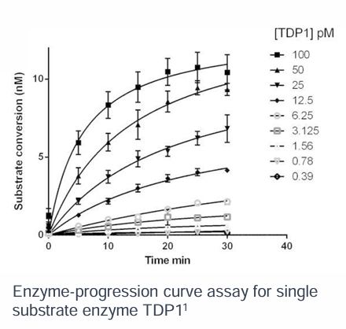
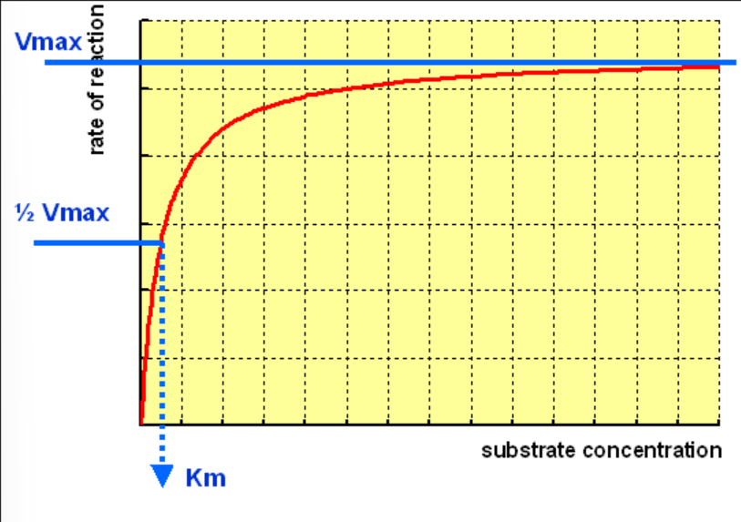
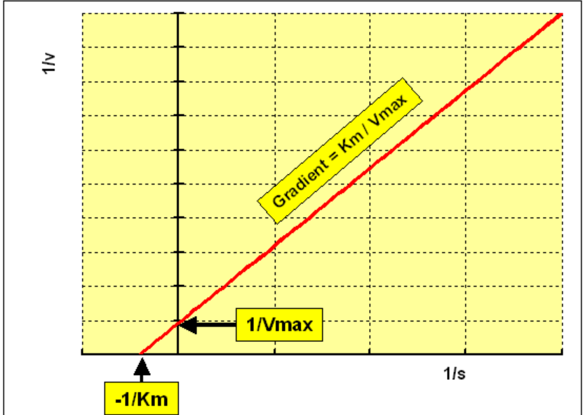
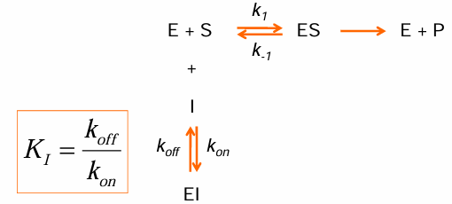

# Pharmacology of the main drug targets

## Find a Druggable Target

### Druggable

- Ligands can get into the binding site. (Considering the hydrophilicity balance, neither too hydrophilic nor too hydrophobic).
- Containing a binding site, with high drug binding affinities (affinity means the degree of firmness the ligand binds to the protein).
- The binding must elicit a response. (efficacy)

## Common Drug Targets

### **Ion Channels**

These kinds of drug targets are often located in the CNS and participate in pain control.

The change in potential serves as a straightforward means to evaluate the activity of a single receptor.

Voltage-sensitive dyes can be used.

### **GPCR**

G protein-coupled receptors (GPCRs) are a series of transmembrane receptors coupling with G proteins[^1].

#### Quick Facts

- **Location**: on the plasma membrane.
- **Ligands** including peptides, hormones, photons, ions, and small molecules.
- GPCRs are **targets of 30% drugs**.

#### Signaling

Two features of GPCRs are expected to be focused on:

1. Desensitisation: when signals are too high, cells internalise and recycle GPCRs to desensitise themselves.
2. Biased agonism: The activation of a particular kind of G protein by one agonist may generate signals participating in many downstream pathways, which further account for **on-target** side effects.
3. Some GPCRs display intrinsic activities, which means they can be activated even though there is no exogenous agonist.

### **Enzymes**

#### Quick Facts

- Location: Soluble or membrane-bound
- The most common type transfers phosphate and triggers cascade signalling.
- Ligands can interact with the plasma side of enzymes located on the cell membrane and create reactions inside the cytosol.

### **Protein-Protein Interactions for Signalling**

#### Protein-Protein interactions transduct signals

>Protein-protein interactions occur for signal transduction & some enzymes are only active as multimeric complexes.

#### Drugs Targeting Protein-Protein Interactions

Since interacting proteins may be large in scale, drugs designed to interact with (inhibit or stabilise) this process may also have a considerable size.

This obviously does not comply with the Lipinsky rule-of-five. Drugs can be hard to absorb. Hence, some focus on designing drugs in reasonable sizes (such as some cyclic peptides) or take peptic compounds in terms of small molecules.

In another aspect, drugs are also designed to **increase binding** affinities between proteins through an allosteric effect or acting as the interface.

## **Receptor Pharmacology**

### Affinity

Affinity describes how drugs bind to their receptors:

$$
Drug + Receptor \rightleftharpoons_{K_{off}}^{K_{on}} Drug-Receptor Complex
$$

More specifically, the whole process can be described as **Association**, **Steady state**, and **Dissociation**. <b>Among these different stages, the dissociation stage represents affinities between drugs and receptors.</b>

#### Meaning of Affinity

Higher affinity also means that a lower dosage and a less frequent administration are needed. These outcomes benefit in terms of decreasing off-target effects, achieving long-term actions, and improving patient compliance.

#### Quantitative Description: Dissociation Constant $K_D$

$$
K_D = \frac{k_{off}}{k_{on}}
$$
$K_D$ is also defined as half of the 'max binding' $B_{max}$.

### Efficacy

Efficacy describes the extent to which responses are elicited after binding occurs.

There are two concepts deescribing drugs' efficacies: [**Full agonist and Partial agonist**](#full-and-partial-agonist)

*Binding* does not mean response. However, if a drug shows efficacy, it must bind to something.

Sometimes we do not want a very high efficacy, aiming to get rid of side effects.

### Potency

Potency is a measure of the necessary amount of the drug to produce an effect of a given magnitude.

 Potency depends on both <b>affinity</b> and <b>efficacy</b>

In general cases, **potency** lines up with **affinity**. If they are a long way different, it suggests there's a problem somewhere in one of the sites that is not correct.

#### Quantitative Description: $IC_{50}$ and $EC_{50}$

$EC_{50}$ is the concentration of a drug required to elicit a 50% response and reflects the potency of the given drug.

 Smaller $EC_{50}$ values indicate stronger potency

Plot bound percentage against $\log[Compound]$ and end up with a -1 slope (usually $k \in \{0.5, 2\}$) sigmoidal curve.

To get the maximum inhibitory concentration, you need to know what your inhibited enzyme looks like, which might be challenging.

## **Ligand View**

### **Full and Partial Agonist**

Full and partial agonists are two concepts describing the  efficacy  properties of drugs.

Full agonists elicit 100% efficacy, while partial agonists are weaker in terms of efficacy. (There is nothing to do with potency)

### **Antagonist**

Antagonists do not trigger **any** effect.

#### Competitive vs Noncompetitive Antagonist

The situation in `Agonist + Noncompetitive Antagonist` is a little bit similar to that in `Full Agonist vs Partial Agonist`, in which efficacy is reduced and potency remains the same.

### **Inverse Agonist**

Sometimes, there might be some receptors (GPCRs or mutation-induced) that possess *intrinsic activity*, which means they exhibit activities even though there is no agonist. In this case, **inverse agonists** bind to inhibit the baseline activity.

### **Positive/ Negative Allosteric Modulators**

- Allosteric modulators have no effect on their own, but enhance or reduce the effect of agonists.
- PAMs enhance the effects of agonists
- NAMs reduce the effects of agonists
- Allosteric binding sites will not be distant from original binding sites.

The results of efficacy and potency shifts can be diverse:

## **Enzyme Pharmacology**

### Reaction Rate

The measurement of reaction rate assumes the experiment system neither runs out of substrates nor has an abundance of substrates. (Measurements start at the point where 10% substrate is depleted.) This ensures the accuracy and sensitivity of assays.

#### **Michaelis-Menten Equation**

Reaction rate and some constants can be figured out through this equation and experimental data.

$$
v = \frac {V_{max} \cdot [S]} {[S]+K_m}
$$

where $v$ denotes the reaction rate, $v_{max}$ denotes the maximal reaction rate, and $K_m$ denotes the  concentration of the substrate when reaction reaches half of $v_{max}$ (**Michaelis constant**).

A typical Michaelis-Menten curve, which plots $rate$ against $[S]$, is shown below:

$$
v_0 = \left\{\begin{aligned}
\lim\limits_{[S] \to 0}v_0& = \frac {V_{max}}{K_m}\times [S]\\
v_0& = \frac12 V_{max}\quad when\quad [S] = K_M\\
\lim\limits_{[S] \to \infty}v_0& = V_{max}
\end{aligned}\right.
$$

A traditional means to process the Michaelis-Menten equation is using the Lineweaver-Burk double reciprocal plot:
$$
\frac 1 v = \frac 1 {V_{max}} + \frac {K_m} {V_{max}}\times \frac 1 {[S]}
$$

Linearisation of the Michaelis-Menten curve is based on certain prerequisites, which may incur error. Only linearise data when checking its quality.

### Inhibitors from the View of the Michaelis-Menten Equation

|Inhibitor Type|$V_{max}$|$K_m$|Binding Site|
|:---:|:---:|:---:|:---:|
|Competitive Inhibitor|/|$\uparrow$|Enzyme `E` only|
|Non-competitive Inhibitor|$\downarrow$|/|`ES` and `E`|
|Uncompetitive Inhibitor*|$\downarrow$|$\downarrow$|`ES` complex only|

*: Uncompetitive inhibitors interact with the $E-S$ complexes, which both hinder the production of products and the dissociation of complexes.

Presumably, the interaction site is known, and drugable. A competitive inhibitor might be a good choice. Whereas in the condition that the interaction site is not drugable, having poor hydrophilic property, for example. Allosteric (Non-competitive) inhibitors are good alternatives.

The selection of inhibitors also depends on the purpose: if the ultimate aim is to reduce the product accumulation, noncompetitive inhibitors are the only option, whereas with the purpose of increasing the substrate concentration, both competitive and noncompetitive inhibitors are optional choices.

In terms of competitive inhibition:

smaller off-rate $k_{off}$ indicates a longer effect.

### Some exceptions where conventional methods are not valid

#### Time-dependent Inhibition

The  $k_{off}$ values of time-dependent inhibitors change over time. According to the equation $K_f = \frac {k_{off}} {k_{on}}$, their  inhibition capabilities increase, which further reflect changes in their  potency.

In this case, the original metrics, such as $IC_{50}$ and $k_D$, are meaningless.

#### Bivalent Compounds

Bivalent compounds form a trimer with two proteins instead of a Drug-Protein dimer.

Bivalent compounds (such as PROTAC) might bind to proteins firmly when in pairs, but strongly repel each other when forming a trimer.

Hence, measuring affinity using $K_D$ alone is insufficient. Co-operativity, an odds ratio between $K_D^{binary}$ and $K_D^{ternary}$, is leveraged in this situation:
$$
\alpha = \frac{K_D^{binary}}{K_D^{ternary}} = \left\{\begin{matrix}>1\quad positive\quad cooperative\\
=1\quad non\quad cooperative\\
<1\quad negative\quad cooperative
\end{matrix}\right.
$$

### Degradation kinetics is another parameter for degraders

*Discriminate from [dissociation](#affinity)*

[^1]: G proteins contain 3 subunits, $G_\alpha$, $G_\beta$, and $G_\gamma$. Among these subunits, $G_\alpha$ is the most investigated and is in charge of cascade signal transduction. $G_\beta$ and $G_\gamma$ can signal as a dimer.
